# Projects and dependencies analysis

This document provides a comprehensive overview of the projects and their dependencies in the context of upgrading to .NETCoreApp,Version=v10.0.

## Table of Contents

- [Executive Summary](#executive-Summary)
  - [Highlevel Metrics](#highlevel-metrics)
  - [Projects Compatibility](#projects-compatibility)
  - [Package Compatibility](#package-compatibility)
  - [API Compatibility](#api-compatibility)
- [Aggregate NuGet packages details](#aggregate-nuget-packages-details)
- [Top API Migration Challenges](#top-api-migration-challenges)
  - [Technologies and Features](#technologies-and-features)
  - [Most Frequent API Issues](#most-frequent-api-issues)
- [Projects Relationship Graph](#projects-relationship-graph)
- [Project Details](#project-details)

  - [Core\Pix2d.Core\Pix2d.Core.csproj](#corepix2dcorepix2dcorecsproj)
  - [Core\Pix2d.Infrastructure\Pix2d.Infrastructure.csproj](#corepix2dinfrastructurepix2dinfrastructurecsproj)
  - [Core\Pix2d.Shared\Pix2d.Shared.csproj](#corepix2dsharedpix2dsharedcsproj)
  - [Core\Pix2d.UI\Pix2d.UI.csproj](#corepix2duipix2duicsproj)
  - [Core\SkiaNodes\SkiaNodes.csproj](#coreskianodesskianodescsproj)
  - [Heads\Pix2d.Browser\Pix2d.Browser.csproj](#headspix2dbrowserpix2dbrowsercsproj)
  - [Heads\Pix2d.Desktop.Wap\Pix2d.Desktop.Wap.wapproj](#headspix2ddesktopwappix2ddesktopwapwapproj)
  - [Heads\Pix2d.Desktop\Pix2d.Desktop.csproj](#headspix2ddesktoppix2ddesktopcsproj)
  - [Heads\Pix2d.Droid\Pix2d.Droid.csproj](#headspix2ddroidpix2ddroidcsproj)
  - [Plugins\Effects\Pix2d.Plugins.BaseEffectsSettings\Pix2d.Plugins.BaseEffects.csproj](#pluginseffectspix2dpluginsbaseeffectssettingspix2dpluginsbaseeffectscsproj)
  - [Plugins\FormatSupport\Psd\Pix2d.Plugins.Psd\Pix2d.Plugins.Psd.csproj](#pluginsformatsupportpsdpix2dpluginspsdpix2dpluginspsdcsproj)
  - [Plugins\Pix2d.Plugins.Ai\Pix2d.Plugins.Ai.csproj](#pluginspix2dpluginsaipix2dpluginsaicsproj)
  - [Plugins\Pix2d.Plugins.Drawing\Pix2d.Plugins.Drawing.csproj](#pluginspix2dpluginsdrawingpix2dpluginsdrawingcsproj)
  - [Plugins\Pix2d.Plugins.OpenCv\Pix2d.Plugins.OpenCv.csproj](#pluginspix2dpluginsopencvpix2dpluginsopencvcsproj)
  - [Plugins\Pix2d.Plugins.PixelText\Pix2d.Plugins.PixelText.csproj](#pluginspix2dpluginspixeltextpix2dpluginspixeltextcsproj)
  - [Plugins\Pix2d.Plugins.PngCompress\Pix2d.Plugins.PngCompress.csproj](#pluginspix2dpluginspngcompresspix2dpluginspngcompresscsproj)
  - [Plugins\Pix2d.Plugins.SimplePlugin\Pix2d.Plugins.Simple.csproj](#pluginspix2dpluginssimplepluginpix2dpluginssimplecsproj)
  - [Tests\Pix2d.Core.Tests\Pix2d.Core.Tests.csproj](#testspix2dcoretestspix2dcoretestscsproj)

## Executive Summary

### Highlevel Metrics

| Metric | Count | Status |
| :--- | :---: | :--- |
| Total Projects | 18 | All require upgrade |
| Total NuGet Packages | 27 | 3 need upgrade |
| Total Code Files | 565 |  |
| Total Code Files with Incidents | 53 |  |
| Total Lines of Code | 43437 |  |
| Total Number of Issues | 90 |  |
| Estimated LOC to modify | 51+ | at least 0.1% of codebase |

### Projects Compatibility

| Project | Target Framework | Difficulty | Package Issues | API Issues | Est. LOC Impact | Description |
| :--- | :---: | :---: | :---: | :---: | :---: | :--- |
| [Core\Pix2d.Core\Pix2d.Core.csproj](#corepix2dcorepix2dcorecsproj) | net9.0 | 🟢 Low | 1 | 14 | 14+ | ClassLibrary, Sdk Style = True |
| [Core\Pix2d.Infrastructure\Pix2d.Infrastructure.csproj](#corepix2dinfrastructurepix2dinfrastructurecsproj) | net9.0 | 🟢 Low | 1 | 0 |  | ClassLibrary, Sdk Style = True |
| [Core\Pix2d.Shared\Pix2d.Shared.csproj](#corepix2dsharedpix2dsharedcsproj) | net9.0 | 🟢 Low | 1 | 6 | 6+ | ClassLibrary, Sdk Style = True |
| [Core\Pix2d.UI\Pix2d.UI.csproj](#corepix2duipix2duicsproj) | net9.0 | 🟢 Low | 1 | 3 | 3+ | ClassLibrary, Sdk Style = True |
| [Core\SkiaNodes\SkiaNodes.csproj](#coreskianodesskianodescsproj) | net9.0 | 🟢 Low | 1 | 0 |  | ClassLibrary, Sdk Style = True |
| [Heads\Pix2d.Browser\Pix2d.Browser.csproj](#headspix2dbrowserpix2dbrowsercsproj) | net9.0-browser | 🟢 Low | 1 | 2 | 2+ | DotNetCoreApp, Sdk Style = True |
| [Heads\Pix2d.Desktop.Wap\Pix2d.Desktop.Wap.wapproj](#headspix2ddesktopwappix2ddesktopwapwapproj) | net451 | 🟢 Low | 1 | 0 |  | DotNetCoreApp, Sdk Style = True |
| [Heads\Pix2d.Desktop\Pix2d.Desktop.csproj](#headspix2ddesktoppix2ddesktopcsproj) | net9.0 | 🟢 Low | 1 | 8 | 8+ | WinForms, Sdk Style = True |
| [Heads\Pix2d.Droid\Pix2d.Droid.csproj](#headspix2ddroidpix2ddroidcsproj) | net9.0-android | 🟢 Low | 3 | 15 | 15+ | ClassLibrary, Sdk Style = True |
| [Plugins\Effects\Pix2d.Plugins.BaseEffectsSettings\Pix2d.Plugins.BaseEffects.csproj](#pluginseffectspix2dpluginsbaseeffectssettingspix2dpluginsbaseeffectscsproj) | net9.0 | 🟢 Low | 1 | 0 |  | ClassLibrary, Sdk Style = True |
| [Plugins\FormatSupport\Psd\Pix2d.Plugins.Psd\Pix2d.Plugins.Psd.csproj](#pluginsformatsupportpsdpix2dpluginspsdpix2dpluginspsdcsproj) | net9.0 | 🟢 Low | 1 | 0 |  | ClassLibrary, Sdk Style = True |
| [Plugins\Pix2d.Plugins.Ai\Pix2d.Plugins.Ai.csproj](#pluginspix2dpluginsaipix2dpluginsaicsproj) | net9.0 | 🟢 Low | 1 | 1 | 1+ | ClassLibrary, Sdk Style = True |
| [Plugins\Pix2d.Plugins.Drawing\Pix2d.Plugins.Drawing.csproj](#pluginspix2dpluginsdrawingpix2dpluginsdrawingcsproj) | net9.0 | 🟢 Low | 1 | 0 |  | ClassLibrary, Sdk Style = True |
| [Plugins\Pix2d.Plugins.OpenCv\Pix2d.Plugins.OpenCv.csproj](#pluginspix2dpluginsopencvpix2dpluginsopencvcsproj) | net9.0 | 🟢 Low | 1 | 0 |  | ClassLibrary, Sdk Style = True |
| [Plugins\Pix2d.Plugins.PixelText\Pix2d.Plugins.PixelText.csproj](#pluginspix2dpluginspixeltextpix2dpluginspixeltextcsproj) | net9.0 | 🟢 Low | 1 | 0 |  | ClassLibrary, Sdk Style = True |
| [Plugins\Pix2d.Plugins.PngCompress\Pix2d.Plugins.PngCompress.csproj](#pluginspix2dpluginspngcompresspix2dpluginspngcompresscsproj) | net9.0 | 🟢 Low | 1 | 2 | 2+ | ClassLibrary, Sdk Style = True |
| [Plugins\Pix2d.Plugins.SimplePlugin\Pix2d.Plugins.Simple.csproj](#pluginspix2dpluginssimplepluginpix2dpluginssimplecsproj) | net9.0 | 🟢 Low | 1 | 0 |  | ClassLibrary, Sdk Style = True |
| [Tests\Pix2d.Core.Tests\Pix2d.Core.Tests.csproj](#testspix2dcoretestspix2dcoretestscsproj) | net9.0 | 🟢 Low | 2 | 0 |  | DotNetCoreApp, Sdk Style = True |

### Package Compatibility

| Status | Count | Percentage |
| :--- | :---: | :---: |
| ✅ Compatible | 24 | 88.9% |
| ⚠️ Incompatible | 3 | 11.1% |
| 🔄 Upgrade Recommended | 0 | 0.0% |
| ***Total NuGet Packages*** | ***27*** | ***100%*** |

### API Compatibility

| Category | Count | Impact |
| :--- | :---: | :--- |
| 🔴 Binary Incompatible | 0 | High - Require code changes |
| 🟡 Source Incompatible | 27 | Medium - Needs re-compilation and potential conflicting API error fixing |
| 🔵 Behavioral change | 24 | Low - Behavioral changes that may require testing at runtime |
| ✅ Compatible | 48330 |  |
| ***Total APIs Analyzed*** | ***48381*** |  |

## Aggregate NuGet packages details

| Package | Current Version | Suggested Version | Projects | Description |
| :--- | :---: | :---: | :--- | :--- |
| Avalonia | 11.3.12 |  | [Pix2d.Core.csproj](#corepix2dcorepix2dcorecsproj) [Pix2d.Desktop.csproj](#headspix2ddesktoppix2ddesktopcsproj) [Pix2d.UI.csproj](#corepix2duipix2duicsproj) | ✅Compatible |
| Avalonia.Android | 11.3.12 |  | [Pix2d.Droid.csproj](#headspix2ddroidpix2ddroidcsproj) | ⚠️NuGet package is incompatible |
| Avalonia.Browser | 11.3.12 |  | [Pix2d.Browser.csproj](#headspix2dbrowserpix2dbrowsercsproj) | ✅Compatible |
| Avalonia.Desktop | 11.3.12 |  | [Pix2d.Desktop.csproj](#headspix2ddesktoppix2ddesktopcsproj) | ✅Compatible |
| Avalonia.Diagnostics | 11.3.12 |  | [Pix2d.Desktop.csproj](#headspix2ddesktoppix2ddesktopcsproj) | ✅Compatible |
| Avalonia.Fonts.Inter | 11.3.12 |  | [Pix2d.Droid.csproj](#headspix2ddroidpix2ddroidcsproj) | ✅Compatible |
| Avalonia.Markup.Declarative | 11.3.7-beta05 |  | [Pix2d.Core.csproj](#corepix2dcorepix2dcorecsproj) | ✅Compatible |
| Avalonia.Skia | 11.3.12 |  | [Pix2d.Core.csproj](#corepix2dcorepix2dcorecsproj) | ✅Compatible |
| Avalonia.Themes.Simple | 11.3.12 |  | [Pix2d.Core.csproj](#corepix2dcorepix2dcorecsproj) | ✅Compatible |
| Clowd.Clipboard | 1.1.4 |  | [Pix2d.Desktop.csproj](#headspix2ddesktoppix2ddesktopcsproj) | ✅Compatible |
| Clowd.Clipboard.Gdi | 1.1.4 |  | [Pix2d.Desktop.csproj](#headspix2ddesktoppix2ddesktopcsproj) | ✅Compatible |
| coverlet.collector | 8.0.0 |  | [Pix2d.Core.Tests.csproj](#testspix2dcoretestspix2dcoretestscsproj) | ✅Compatible |
| Microsoft.Extensions.DependencyInjection | 10.0.5 |  | [Pix2d.Infrastructure.csproj](#corepix2dinfrastructurepix2dinfrastructurecsproj) | ✅Compatible |
| Microsoft.Maui.Essentials | 10.0.50 |  | [Pix2d.Droid.csproj](#headspix2ddroidpix2ddroidcsproj) | ✅Compatible |
| Microsoft.ML.OnnxRuntime | 1.24.3 |  | [Pix2d.Plugins.Ai.csproj](#pluginspix2dpluginsaipix2dpluginsaicsproj) | ✅Compatible |
| Microsoft.NET.Test.Sdk | 18.3.0 |  | [Pix2d.Core.Tests.csproj](#testspix2dcoretestspix2dcoretestscsproj) | ✅Compatible |
| Moq | 4.20.72 |  | [Pix2d.Core.Tests.csproj](#testspix2dcoretestspix2dcoretestscsproj) | ✅Compatible |
| Newtonsoft.Json | 13.0.4 |  | [Pix2d.Shared.csproj](#corepix2dsharedpix2dsharedcsproj) [SkiaNodes.csproj](#coreskianodesskianodescsproj) | ✅Compatible |
| OpenCvSharp4.Windows | 4.13.0.20260302 |  | [Pix2d.Plugins.OpenCv.csproj](#pluginspix2dpluginsopencvpix2dpluginsopencvcsproj) | ✅Compatible |
| Plugin.StoreReview | 6.2.0 |  | [Pix2d.Droid.csproj](#headspix2ddroidpix2ddroidcsproj) | ✅Compatible |
| SixLabors.ImageSharp | 3.1.12 |  | [Pix2d.Plugins.PngCompress.csproj](#pluginspix2dpluginspngcompresspix2dpluginspngcompresscsproj) | ✅Compatible |
| SkiaSharp | 3.119.2 |  | [Pix2d.Browser.csproj](#headspix2dbrowserpix2dbrowsercsproj) [Pix2d.Shared.csproj](#corepix2dsharedpix2dsharedcsproj) [SkiaNodes.csproj](#coreskianodesskianodescsproj) | ✅Compatible |
| SkiaSharp.NativeAssets.WebAssembly | 3.119.2 |  | [Pix2d.Browser.csproj](#headspix2dbrowserpix2dbrowsercsproj) | ✅Compatible |
| Xamarin.AndroidX.Core.SplashScreen | 1.2.0.2 |  | [Pix2d.Droid.csproj](#headspix2ddroidpix2ddroidcsproj) | ⚠️NuGet package is incompatible |
| Xaml.Behaviors | 11.3.9.5 |  | [Pix2d.Core.csproj](#corepix2dcorepix2dcorecsproj) | ✅Compatible |
| xunit | 2.9.3 |  | [Pix2d.Core.Tests.csproj](#testspix2dcoretestspix2dcoretestscsproj) | ⚠️NuGet package is deprecated |
| xunit.runner.visualstudio | 3.1.5 |  | [Pix2d.Core.Tests.csproj](#testspix2dcoretestspix2dcoretestscsproj) | ✅Compatible |

## Top API Migration Challenges

### Technologies and Features

| Technology | Issues | Percentage | Migration Path |
| :--- | :---: | :---: | :--- |
| GDI+ / System.Drawing | 7 | 13.7% | System.Drawing APIs for 2D graphics, imaging, and printing that are available via NuGet package System.Drawing.Common. Note: Not recommended for server scenarios due to Windows dependencies; consider cross-platform alternatives like SkiaSharp or ImageSharp for new code. |

### Most Frequent API Issues

| API | Count | Percentage | Category |
| :--- | :---: | :---: | :--- |
| T:System.Uri | 10 | 19.6% | Behavioral Change |
| M:System.TimeSpan.FromSeconds(System.Int64) | 5 | 9.8% | Source Incompatible |
| M:System.TimeSpan.FromMilliseconds(System.Int64,System.Int64) | 4 | 7.8% | Source Incompatible |
| T:Microsoft.Maui.ApplicationModel.MainThread | 4 | 7.8% | Source Incompatible |
| M:Microsoft.Maui.ApplicationModel.MainThread.BeginInvokeOnMainThread(System.Action) | 4 | 7.8% | Source Incompatible |
| P:System.Uri.AbsolutePath | 3 | 5.9% | Behavioral Change |
| M:System.IO.Compression.ZipArchive.#ctor(System.IO.Stream,System.IO.Compression.ZipArchiveMode,System.Boolean,System.Text.Encoding) | 3 | 5.9% | Behavioral Change |
| M:System.IO.Compression.ZipArchive.CreateEntry(System.String,System.IO.Compression.CompressionLevel) | 3 | 5.9% | Behavioral Change |
| M:System.Uri.#ctor(System.String) | 2 | 3.9% | Behavioral Change |
| M:System.IO.Path.Combine(System.ReadOnlySpan{System.String}) | 2 | 3.9% | Source Incompatible |
| T:System.Drawing.Imaging.ImageFormat | 2 | 3.9% | Source Incompatible |
| T:System.Drawing.Image | 2 | 3.9% | Source Incompatible |
| P:System.Uri.AbsoluteUri | 2 | 3.9% | Behavioral Change |
| P:System.Drawing.Imaging.ImageFormat.Png | 1 | 2.0% | Source Incompatible |
| M:System.Drawing.Image.Save(System.IO.Stream,System.Drawing.Imaging.ImageFormat) | 1 | 2.0% | Source Incompatible |
| M:System.Drawing.Image.FromStream(System.IO.Stream) | 1 | 2.0% | Source Incompatible |
| T:System.Net.Http.HttpContent | 1 | 2.0% | Behavioral Change |
| M:System.TimeSpan.FromSeconds(System.Double) | 1 | 2.0% | Source Incompatible |

## Projects Relationship Graph

Legend:
📦 SDK-style project
⚙️ Classic project

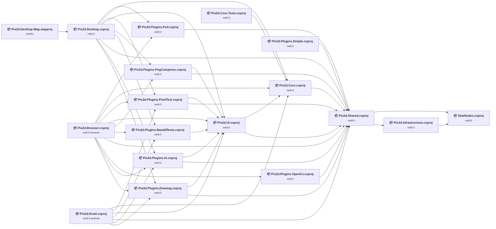

## Project Details

### Core\Pix2d.Core\Pix2d.Core.csproj

#### Project Info

- **Current Target Framework:** net9.0
- **Proposed Target Framework:** net10.0
- **SDK-style**: True
- **Project Kind:** ClassLibrary
- **Dependencies**: 1
- **Dependants**: 5
- **Number of Files**: 106
- **Number of Files with Incidents**: 7
- **Lines of Code**: 11622
- **Estimated LOC to modify**: 14+ (at least 0.1% of the project)

#### Dependency Graph

Legend:
📦 SDK-style project
⚙️ Classic project

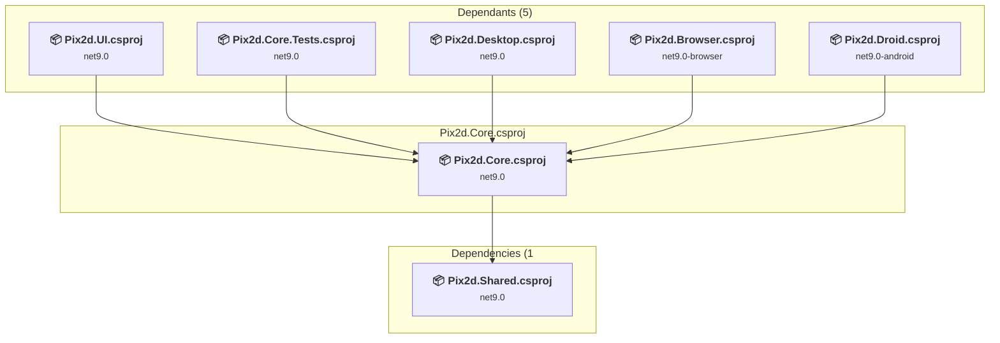

### API Compatibility

| Category | Count | Impact |
| :--- | :---: | :--- |
| 🔴 Binary Incompatible | 0 | High - Require code changes |
| 🟡 Source Incompatible | 7 | Medium - Needs re-compilation and potential conflicting API error fixing |
| 🔵 Behavioral change | 7 | Low - Behavioral changes that may require testing at runtime |
| ✅ Compatible | 11397 |  |
| ***Total APIs Analyzed*** | ***11411*** |  |

### Core\Pix2d.Infrastructure\Pix2d.Infrastructure.csproj

#### Project Info

- **Current Target Framework:** net9.0
- **Proposed Target Framework:** net10.0
- **SDK-style**: True
- **Project Kind:** ClassLibrary
- **Dependencies**: 1
- **Dependants**: 1
- **Number of Files**: 29
- **Number of Files with Incidents**: 2
- **Lines of Code**: 1452
- **Estimated LOC to modify**: 0+ (at least 0.0% of the project)

#### Dependency Graph

Legend:
📦 SDK-style project
⚙️ Classic project

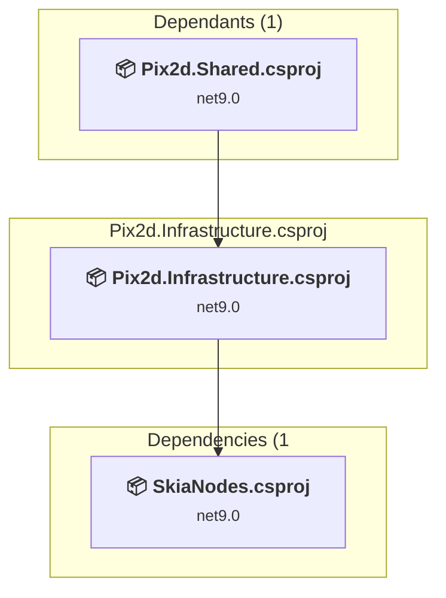

### API Compatibility

| Category | Count | Impact |
| :--- | :---: | :--- |
| 🔴 Binary Incompatible | 0 | High - Require code changes |
| 🟡 Source Incompatible | 0 | Medium - Needs re-compilation and potential conflicting API error fixing |
| 🔵 Behavioral change | 0 | Low - Behavioral changes that may require testing at runtime |
| ✅ Compatible | 1400 |  |
| ***Total APIs Analyzed*** | ***1400*** |  |

### Core\Pix2d.Shared\Pix2d.Shared.csproj

#### Project Info

- **Current Target Framework:** net9.0
- **Proposed Target Framework:** net10.0
- **SDK-style**: True
- **Project Kind:** ClassLibrary
- **Dependencies**: 2
- **Dependants**: 12
- **Number of Files**: 199
- **Number of Files with Incidents**: 4
- **Lines of Code**: 8627
- **Estimated LOC to modify**: 6+ (at least 0.1% of the project)

#### Dependency Graph

Legend:
📦 SDK-style project
⚙️ Classic project

```mermaid
flowchart TB
    subgraph upstream["Dependants (12)"]
        P1["<b>📦&nbsp;Pix2d.Plugins.Ai.csproj</b><br/><small>net9.0</small>"]
        P3["<b>📦&nbsp;Pix2d.UI.csproj</b><br/><small>net9.0</small>"]
        P5["<b>📦&nbsp;Pix2d.Plugins.OpenCv.csproj</b><br/><small>net9.0</small>"]
        P6["<b>📦&nbsp;Pix2d.Plugins.Simple.csproj</b><br/><small>net9.0</small>"]
        P7["<b>📦&nbsp;Pix2d.Plugins.Drawing.csproj</b><br/><small>net9.0</small>"]
        P8["<b>📦&nbsp;Pix2d.Plugins.PixelText.csproj</b><br/><small>net9.0</small>"]
        P9["<b>📦&nbsp;Pix2d.Plugins.PngCompress.csproj</b><br/><small>net9.0</small>"]
        P10["<b>📦&nbsp;Pix2d.Plugins.Psd.csproj</b><br/><small>net9.0</small>"]
        P14["<b>📦&nbsp;Pix2d.Core.csproj</b><br/><small>net9.0</small>"]
        P15["<b>📦&nbsp;Pix2d.Desktop.csproj</b><br/><small>net9.0</small>"]
        P16["<b>📦&nbsp;Pix2d.Browser.csproj</b><br/><small>net9.0-browser</small>"]
        P18["<b>📦&nbsp;Pix2d.Droid.csproj</b><br/><small>net9.0-android</small>"]
        click P1 "#pluginspix2dpluginsaipix2dpluginsaicsproj"
        click P3 "#corepix2duipix2duicsproj"
        click P5 "#pluginspix2dpluginsopencvpix2dpluginsopencvcsproj"
        click P6 "#pluginspix2dpluginssimplepluginpix2dpluginssimplecsproj"
        click P7 "#pluginspix2dpluginsdrawingpix2dpluginsdrawingcsproj"
        click P8 "#pluginspix2dpluginspixeltextpix2dpluginspixeltextcsproj"
        click P9 "#pluginspix2dpluginspngcompresspix2dpluginspngcompresscsproj"
        click P10 "#pluginsformatsupportpsdpix2dpluginspsdpix2dpluginspsdcsproj"
        click P14 "#corepix2dcorepix2dcorecsproj"
        click P15 "#headspix2ddesktoppix2ddesktopcsproj"
        click P16 "#headspix2dbrowserpix2dbrowsercsproj"
        click P18 "#headspix2ddroidpix2ddroidcsproj"
    end
    subgraph current["Pix2d.Shared.csproj"]
        MAIN["<b>📦&nbsp;Pix2d.Shared.csproj</b><br/><small>net9.0</small>"]
        click MAIN "#corepix2dsharedpix2dsharedcsproj"
    end
    subgraph downstream["Dependencies (2"]
        P12["<b>📦&nbsp;SkiaNodes.csproj</b><br/><small>net9.0</small>"]
        P13["<b>📦&nbsp;Pix2d.Infrastructure.csproj</b><br/><small>net9.0</small>"]
        click P12 "#coreskianodesskianodescsproj"
        click P13 "#corepix2dinfrastructurepix2dinfrastructurecsproj"
    end
    P1 --> MAIN
    P3 --> MAIN
    P5 --> MAIN
    P6 --> MAIN
    P7 --> MAIN
    P8 --> MAIN
    P9 --> MAIN
    P10 --> MAIN
    P14 --> MAIN
    P15 --> MAIN
    P16 --> MAIN
    P18 --> MAIN
    MAIN --> P12
    MAIN --> P13

```

### API Compatibility

| Category | Count | Impact |
| :--- | :---: | :--- |
| 🔴 Binary Incompatible | 0 | High - Require code changes |
| 🟡 Source Incompatible | 0 | Medium - Needs re-compilation and potential conflicting API error fixing |
| 🔵 Behavioral change | 6 | Low - Behavioral changes that may require testing at runtime |
| ✅ Compatible | 6743 |  |
| ***Total APIs Analyzed*** | ***6749*** |  |

### Core\Pix2d.UI\Pix2d.UI.csproj

#### Project Info

- **Current Target Framework:** net9.0
- **Proposed Target Framework:** net10.0
- **SDK-style**: True
- **Project Kind:** ClassLibrary
- **Dependencies**: 2
- **Dependants**: 8
- **Number of Files**: 58
- **Number of Files with Incidents**: 3
- **Lines of Code**: 7448
- **Estimated LOC to modify**: 3+ (at least 0.0% of the project)

#### Dependency Graph

Legend:
📦 SDK-style project
⚙️ Classic project

```mermaid
flowchart TB
    subgraph upstream["Dependants (8)"]
        P1["<b>📦&nbsp;Pix2d.Plugins.Ai.csproj</b><br/><small>net9.0</small>"]
        P7["<b>📦&nbsp;Pix2d.Plugins.Drawing.csproj</b><br/><small>net9.0</small>"]
        P8["<b>📦&nbsp;Pix2d.Plugins.PixelText.csproj</b><br/><small>net9.0</small>"]
        P9["<b>📦&nbsp;Pix2d.Plugins.PngCompress.csproj</b><br/><small>net9.0</small>"]
        P11["<b>📦&nbsp;Pix2d.Plugins.BaseEffects.csproj</b><br/><small>net9.0</small>"]
        P15["<b>📦&nbsp;Pix2d.Desktop.csproj</b><br/><small>net9.0</small>"]
        P16["<b>📦&nbsp;Pix2d.Browser.csproj</b><br/><small>net9.0-browser</small>"]
        P18["<b>📦&nbsp;Pix2d.Droid.csproj</b><br/><small>net9.0-android</small>"]
        click P1 "#pluginspix2dpluginsaipix2dpluginsaicsproj"
        click P7 "#pluginspix2dpluginsdrawingpix2dpluginsdrawingcsproj"
        click P8 "#pluginspix2dpluginspixeltextpix2dpluginspixeltextcsproj"
        click P9 "#pluginspix2dpluginspngcompresspix2dpluginspngcompresscsproj"
        click P11 "#pluginseffectspix2dpluginsbaseeffectssettingspix2dpluginsbaseeffectscsproj"
        click P15 "#headspix2ddesktoppix2ddesktopcsproj"
        click P16 "#headspix2dbrowserpix2dbrowsercsproj"
        click P18 "#headspix2ddroidpix2ddroidcsproj"
    end
    subgraph current["Pix2d.UI.csproj"]
        MAIN["<b>📦&nbsp;Pix2d.UI.csproj</b><br/><small>net9.0</small>"]
        click MAIN "#corepix2duipix2duicsproj"
    end
    subgraph downstream["Dependencies (2"]
        P14["<b>📦&nbsp;Pix2d.Core.csproj</b><br/><small>net9.0</small>"]
        P2["<b>📦&nbsp;Pix2d.Shared.csproj</b><br/><small>net9.0</small>"]
        click P14 "#corepix2dcorepix2dcorecsproj"
        click P2 "#corepix2dsharedpix2dsharedcsproj"
    end
    P1 --> MAIN
    P7 --> MAIN
    P8 --> MAIN
    P9 --> MAIN
    P11 --> MAIN
    P15 --> MAIN
    P16 --> MAIN
    P18 --> MAIN
    MAIN --> P14
    MAIN --> P2

```

### API Compatibility

| Category | Count | Impact |
| :--- | :---: | :--- |
| 🔴 Binary Incompatible | 0 | High - Require code changes |
| 🟡 Source Incompatible | 1 | Medium - Needs re-compilation and potential conflicting API error fixing |
| 🔵 Behavioral change | 2 | Low - Behavioral changes that may require testing at runtime |
| ✅ Compatible | 15704 |  |
| ***Total APIs Analyzed*** | ***15707*** |  |

### Core\SkiaNodes\SkiaNodes.csproj

#### Project Info

- **Current Target Framework:** net9.0
- **Proposed Target Framework:** net10.0
- **SDK-style**: True
- **Project Kind:** ClassLibrary
- **Dependencies**: 0
- **Dependants**: 2
- **Number of Files**: 62
- **Number of Files with Incidents**: 2
- **Lines of Code**: 4064
- **Estimated LOC to modify**: 0+ (at least 0.0% of the project)

#### Dependency Graph

Legend:
📦 SDK-style project
⚙️ Classic project

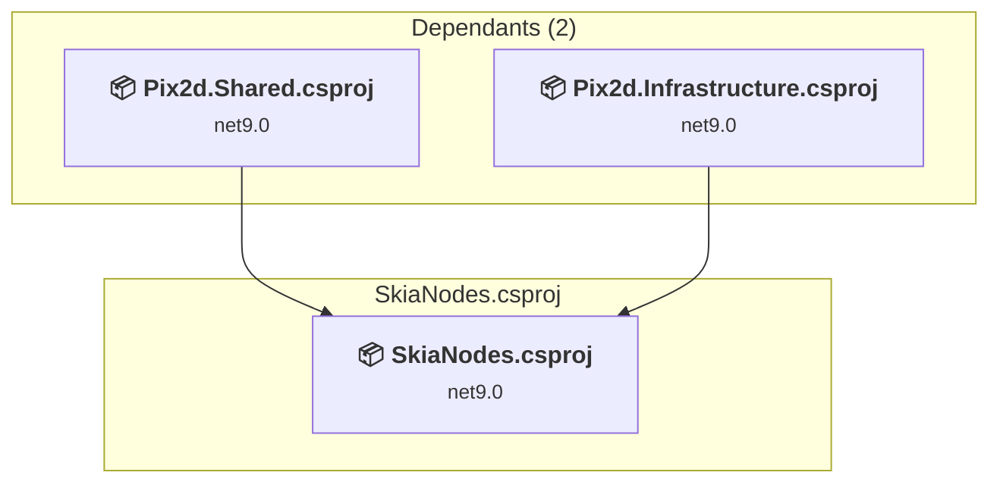

### API Compatibility

| Category | Count | Impact |
| :--- | :---: | :--- |
| 🔴 Binary Incompatible | 0 | High - Require code changes |
| 🟡 Source Incompatible | 0 | Medium - Needs re-compilation and potential conflicting API error fixing |
| 🔵 Behavioral change | 0 | Low - Behavioral changes that may require testing at runtime |
| ✅ Compatible | 3116 |  |
| ***Total APIs Analyzed*** | ***3116*** |  |

### Heads\Pix2d.Browser\Pix2d.Browser.csproj

#### Project Info

- **Current Target Framework:** net9.0-browser
- **Proposed Target Framework:** net10.0--browser
- **SDK-style**: True
- **Project Kind:** DotNetCoreApp
- **Dependencies**: 10
- **Dependants**: 0
- **Number of Files**: 19
- **Number of Files with Incidents**: 3
- **Lines of Code**: 280
- **Estimated LOC to modify**: 2+ (at least 0.7% of the project)

#### Dependency Graph

Legend:
📦 SDK-style project
⚙️ Classic project

```mermaid
flowchart TB
    subgraph current["Pix2d.Browser.csproj"]
        MAIN["<b>📦&nbsp;Pix2d.Browser.csproj</b><br/><small>net9.0-browser</small>"]
        click MAIN "#headspix2dbrowserpix2dbrowsercsproj"
    end
    subgraph downstream["Dependencies (10"]
        P10["<b>📦&nbsp;Pix2d.Plugins.Psd.csproj</b><br/><small>net9.0</small>"]
        P14["<b>📦&nbsp;Pix2d.Core.csproj</b><br/><small>net9.0</small>"]
        P8["<b>📦&nbsp;Pix2d.Plugins.PixelText.csproj</b><br/><small>net9.0</small>"]
        P3["<b>📦&nbsp;Pix2d.UI.csproj</b><br/><small>net9.0</small>"]
        P9["<b>📦&nbsp;Pix2d.Plugins.PngCompress.csproj</b><br/><small>net9.0</small>"]
        P11["<b>📦&nbsp;Pix2d.Plugins.BaseEffects.csproj</b><br/><small>net9.0</small>"]
        P2["<b>📦&nbsp;Pix2d.Shared.csproj</b><br/><small>net9.0</small>"]
        P5["<b>📦&nbsp;Pix2d.Plugins.OpenCv.csproj</b><br/><small>net9.0</small>"]
        P1["<b>📦&nbsp;Pix2d.Plugins.Ai.csproj</b><br/><small>net9.0</small>"]
        P7["<b>📦&nbsp;Pix2d.Plugins.Drawing.csproj</b><br/><small>net9.0</small>"]
        click P10 "#pluginsformatsupportpsdpix2dpluginspsdpix2dpluginspsdcsproj"
        click P14 "#corepix2dcorepix2dcorecsproj"
        click P8 "#pluginspix2dpluginspixeltextpix2dpluginspixeltextcsproj"
        click P3 "#corepix2duipix2duicsproj"
        click P9 "#pluginspix2dpluginspngcompresspix2dpluginspngcompresscsproj"
        click P11 "#pluginseffectspix2dpluginsbaseeffectssettingspix2dpluginsbaseeffectscsproj"
        click P2 "#corepix2dsharedpix2dsharedcsproj"
        click P5 "#pluginspix2dpluginsopencvpix2dpluginsopencvcsproj"
        click P1 "#pluginspix2dpluginsaipix2dpluginsaicsproj"
        click P7 "#pluginspix2dpluginsdrawingpix2dpluginsdrawingcsproj"
    end
    MAIN --> P10
    MAIN --> P14
    MAIN --> P8
    MAIN --> P3
    MAIN --> P9
    MAIN --> P11
    MAIN --> P2
    MAIN --> P5
    MAIN --> P1
    MAIN --> P7

```

### API Compatibility

| Category | Count | Impact |
| :--- | :---: | :--- |
| 🔴 Binary Incompatible | 0 | High - Require code changes |
| 🟡 Source Incompatible | 0 | Medium - Needs re-compilation and potential conflicting API error fixing |
| 🔵 Behavioral change | 2 | Low - Behavioral changes that may require testing at runtime |
| ✅ Compatible | 177 |  |
| ***Total APIs Analyzed*** | ***179*** |  |

### Heads\Pix2d.Desktop.Wap\Pix2d.Desktop.Wap.wapproj

#### Project Info

- **Current Target Framework:** net451
- **Proposed Target Framework:** net10.0
- **SDK-style**: True
- **Project Kind:** DotNetCoreApp
- **Dependencies**: 1
- **Dependants**: 0
- **Number of Files**: 9
- **Number of Files with Incidents**: 2
- **Lines of Code**: 0
- **Estimated LOC to modify**: 0+ (at least 0.0% of the project)

#### Dependency Graph

Legend:
📦 SDK-style project
⚙️ Classic project

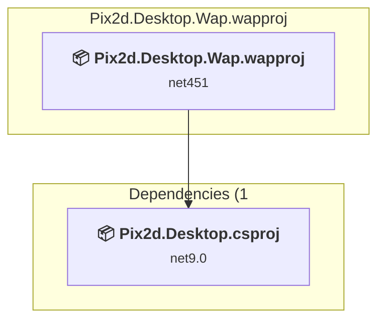

### API Compatibility

| Category | Count | Impact |
| :--- | :---: | :--- |
| 🔴 Binary Incompatible | 0 | High - Require code changes |
| 🟡 Source Incompatible | 0 | Medium - Needs re-compilation and potential conflicting API error fixing |
| 🔵 Behavioral change | 0 | Low - Behavioral changes that may require testing at runtime |
| ✅ Compatible | 0 |  |
| ***Total APIs Analyzed*** | ***0*** |  |

### Heads\Pix2d.Desktop\Pix2d.Desktop.csproj

#### Project Info

- **Current Target Framework:** net9.0
- **Proposed Target Framework:** net10.0-windows
- **SDK-style**: True
- **Project Kind:** WinForms
- **Dependencies**: 9
- **Dependants**: 1
- **Number of Files**: 3
- **Number of Files with Incidents**: 4
- **Lines of Code**: 410
- **Estimated LOC to modify**: 8+ (at least 2.0% of the project)

#### Dependency Graph

Legend:
📦 SDK-style project
⚙️ Classic project

```mermaid
flowchart TB
    subgraph upstream["Dependants (1)"]
        P17["<b>📦&nbsp;Pix2d.Desktop.Wap.wapproj</b><br/><small>net451</small>"]
        click P17 "#headspix2ddesktopwappix2ddesktopwapwapproj"
    end
    subgraph current["Pix2d.Desktop.csproj"]
        MAIN["<b>📦&nbsp;Pix2d.Desktop.csproj</b><br/><small>net9.0</small>"]
        click MAIN "#headspix2ddesktoppix2ddesktopcsproj"
    end
    subgraph downstream["Dependencies (9"]
        P10["<b>📦&nbsp;Pix2d.Plugins.Psd.csproj</b><br/><small>net9.0</small>"]
        P14["<b>📦&nbsp;Pix2d.Core.csproj</b><br/><small>net9.0</small>"]
        P8["<b>📦&nbsp;Pix2d.Plugins.PixelText.csproj</b><br/><small>net9.0</small>"]
        P3["<b>📦&nbsp;Pix2d.UI.csproj</b><br/><small>net9.0</small>"]
        P9["<b>📦&nbsp;Pix2d.Plugins.PngCompress.csproj</b><br/><small>net9.0</small>"]
        P11["<b>📦&nbsp;Pix2d.Plugins.BaseEffects.csproj</b><br/><small>net9.0</small>"]
        P2["<b>📦&nbsp;Pix2d.Shared.csproj</b><br/><small>net9.0</small>"]
        P1["<b>📦&nbsp;Pix2d.Plugins.Ai.csproj</b><br/><small>net9.0</small>"]
        P7["<b>📦&nbsp;Pix2d.Plugins.Drawing.csproj</b><br/><small>net9.0</small>"]
        click P10 "#pluginsformatsupportpsdpix2dpluginspsdpix2dpluginspsdcsproj"
        click P14 "#corepix2dcorepix2dcorecsproj"
        click P8 "#pluginspix2dpluginspixeltextpix2dpluginspixeltextcsproj"
        click P3 "#corepix2duipix2duicsproj"
        click P9 "#pluginspix2dpluginspngcompresspix2dpluginspngcompresscsproj"
        click P11 "#pluginseffectspix2dpluginsbaseeffectssettingspix2dpluginsbaseeffectscsproj"
        click P2 "#corepix2dsharedpix2dsharedcsproj"
        click P1 "#pluginspix2dpluginsaipix2dpluginsaicsproj"
        click P7 "#pluginspix2dpluginsdrawingpix2dpluginsdrawingcsproj"
    end
    P17 --> MAIN
    MAIN --> P10
    MAIN --> P14
    MAIN --> P8
    MAIN --> P3
    MAIN --> P9
    MAIN --> P11
    MAIN --> P2
    MAIN --> P1
    MAIN --> P7

```

### API Compatibility

| Category | Count | Impact |
| :--- | :---: | :--- |
| 🔴 Binary Incompatible | 0 | High - Require code changes |
| 🟡 Source Incompatible | 8 | Medium - Needs re-compilation and potential conflicting API error fixing |
| 🔵 Behavioral change | 0 | Low - Behavioral changes that may require testing at runtime |
| ✅ Compatible | 375 |  |
| ***Total APIs Analyzed*** | ***383*** |  |

#### Project Technologies and Features

| Technology | Issues | Percentage | Migration Path |
| :--- | :---: | :---: | :--- |
| GDI+ / System.Drawing | 7 | 87.5% | System.Drawing APIs for 2D graphics, imaging, and printing that are available via NuGet package System.Drawing.Common. Note: Not recommended for server scenarios due to Windows dependencies; consider cross-platform alternatives like SkiaSharp or ImageSharp for new code. |

### Heads\Pix2d.Droid\Pix2d.Droid.csproj

#### Project Info

- **Current Target Framework:** net9.0-android
- **Proposed Target Framework:** net10.0-android
- **SDK-style**: True
- **Project Kind:** ClassLibrary
- **Dependencies**: 7
- **Dependants**: 0
- **Number of Files**: 11
- **Number of Files with Incidents**: 6
- **Lines of Code**: 1303
- **Estimated LOC to modify**: 15+ (at least 1.2% of the project)

#### Dependency Graph

Legend:
📦 SDK-style project
⚙️ Classic project

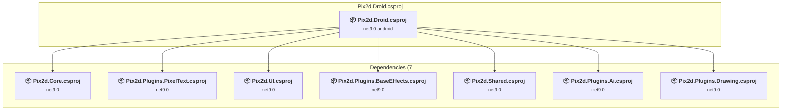

### API Compatibility

| Category | Count | Impact |
| :--- | :---: | :--- |
| 🔴 Binary Incompatible | 0 | High - Require code changes |
| 🟡 Source Incompatible | 11 | Medium - Needs re-compilation and potential conflicting API error fixing |
| 🔵 Behavioral change | 4 | Low - Behavioral changes that may require testing at runtime |
| ✅ Compatible | 1434 |  |
| ***Total APIs Analyzed*** | ***1449*** |  |

### Plugins\Effects\Pix2d.Plugins.BaseEffectsSettings\Pix2d.Plugins.BaseEffects.csproj

#### Project Info

- **Current Target Framework:** net9.0
- **Proposed Target Framework:** net10.0
- **SDK-style**: True
- **Project Kind:** ClassLibrary
- **Dependencies**: 1
- **Dependants**: 3
- **Number of Files**: 9
- **Number of Files with Incidents**: 2
- **Lines of Code**: 240
- **Estimated LOC to modify**: 0+ (at least 0.0% of the project)

#### Dependency Graph

Legend:
📦 SDK-style project
⚙️ Classic project

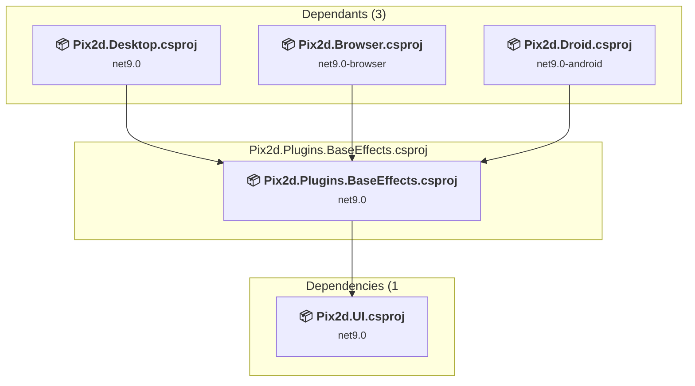

### API Compatibility

| Category | Count | Impact |
| :--- | :---: | :--- |
| 🔴 Binary Incompatible | 0 | High - Require code changes |
| 🟡 Source Incompatible | 0 | Medium - Needs re-compilation and potential conflicting API error fixing |
| 🔵 Behavioral change | 0 | Low - Behavioral changes that may require testing at runtime |
| ✅ Compatible | 495 |  |
| ***Total APIs Analyzed*** | ***495*** |  |

### Plugins\FormatSupport\Psd\Pix2d.Plugins.Psd\Pix2d.Plugins.Psd.csproj

#### Project Info

- **Current Target Framework:** net9.0
- **Proposed Target Framework:** net10.0
- **SDK-style**: True
- **Project Kind:** ClassLibrary
- **Dependencies**: 1
- **Dependants**: 2
- **Number of Files**: 16
- **Number of Files with Incidents**: 2
- **Lines of Code**: 1874
- **Estimated LOC to modify**: 0+ (at least 0.0% of the project)

#### Dependency Graph

Legend:
📦 SDK-style project
⚙️ Classic project

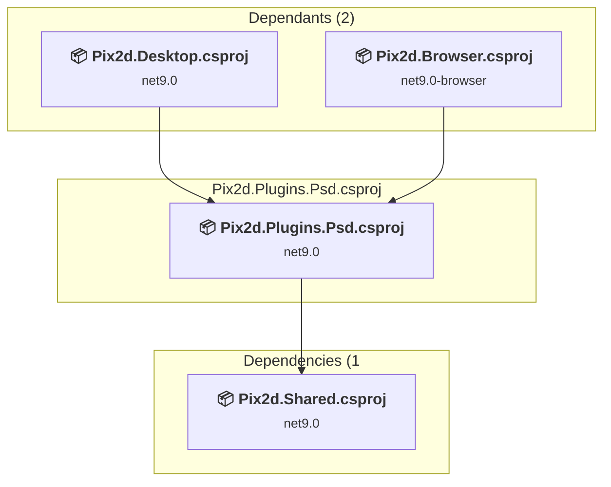

### API Compatibility

| Category | Count | Impact |
| :--- | :---: | :--- |
| 🔴 Binary Incompatible | 0 | High - Require code changes |
| 🟡 Source Incompatible | 0 | Medium - Needs re-compilation and potential conflicting API error fixing |
| 🔵 Behavioral change | 0 | Low - Behavioral changes that may require testing at runtime |
| ✅ Compatible | 1348 |  |
| ***Total APIs Analyzed*** | ***1348*** |  |

### Plugins\Pix2d.Plugins.Ai\Pix2d.Plugins.Ai.csproj

#### Project Info

- **Current Target Framework:** net9.0
- **Proposed Target Framework:** net10.0
- **SDK-style**: True
- **Project Kind:** ClassLibrary
- **Dependencies**: 2
- **Dependants**: 3
- **Number of Files**: 7
- **Number of Files with Incidents**: 3
- **Lines of Code**: 589
- **Estimated LOC to modify**: 1+ (at least 0.2% of the project)

#### Dependency Graph

Legend:
📦 SDK-style project
⚙️ Classic project

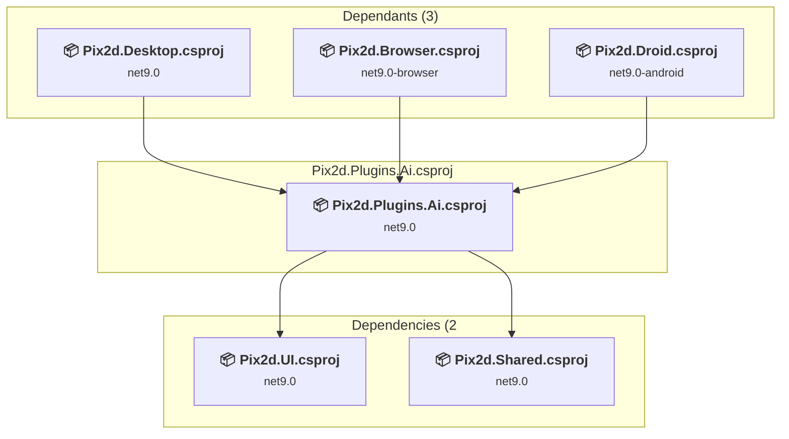

### API Compatibility

| Category | Count | Impact |
| :--- | :---: | :--- |
| 🔴 Binary Incompatible | 0 | High - Require code changes |
| 🟡 Source Incompatible | 0 | Medium - Needs re-compilation and potential conflicting API error fixing |
| 🔵 Behavioral change | 1 | Low - Behavioral changes that may require testing at runtime |
| ✅ Compatible | 590 |  |
| ***Total APIs Analyzed*** | ***591*** |  |

### Plugins\Pix2d.Plugins.Drawing\Pix2d.Plugins.Drawing.csproj

#### Project Info

- **Current Target Framework:** net9.0
- **Proposed Target Framework:** net10.0
- **SDK-style**: True
- **Project Kind:** ClassLibrary
- **Dependencies**: 2
- **Dependants**: 3
- **Number of Files**: 46
- **Number of Files with Incidents**: 2
- **Lines of Code**: 4386
- **Estimated LOC to modify**: 0+ (at least 0.0% of the project)

#### Dependency Graph

Legend:
📦 SDK-style project
⚙️ Classic project

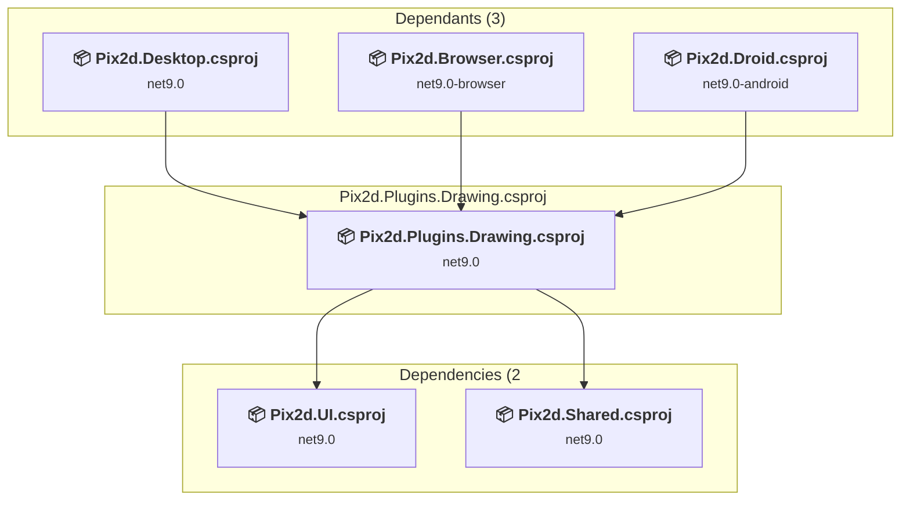

### API Compatibility

| Category | Count | Impact |
| :--- | :---: | :--- |
| 🔴 Binary Incompatible | 0 | High - Require code changes |
| 🟡 Source Incompatible | 0 | Medium - Needs re-compilation and potential conflicting API error fixing |
| 🔵 Behavioral change | 0 | Low - Behavioral changes that may require testing at runtime |
| ✅ Compatible | 4194 |  |
| ***Total APIs Analyzed*** | ***4194*** |  |

### Plugins\Pix2d.Plugins.OpenCv\Pix2d.Plugins.OpenCv.csproj

#### Project Info

- **Current Target Framework:** net9.0
- **Proposed Target Framework:** net10.0
- **SDK-style**: True
- **Project Kind:** ClassLibrary
- **Dependencies**: 1
- **Dependants**: 1
- **Number of Files**: 3
- **Number of Files with Incidents**: 2
- **Lines of Code**: 107
- **Estimated LOC to modify**: 0+ (at least 0.0% of the project)

#### Dependency Graph

Legend:
📦 SDK-style project
⚙️ Classic project

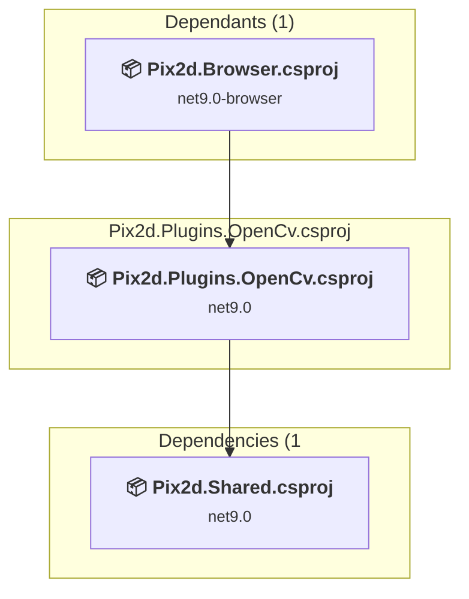

### API Compatibility

| Category | Count | Impact |
| :--- | :---: | :--- |
| 🔴 Binary Incompatible | 0 | High - Require code changes |
| 🟡 Source Incompatible | 0 | Medium - Needs re-compilation and potential conflicting API error fixing |
| 🔵 Behavioral change | 0 | Low - Behavioral changes that may require testing at runtime |
| ✅ Compatible | 66 |  |
| ***Total APIs Analyzed*** | ***66*** |  |

### Plugins\Pix2d.Plugins.PixelText\Pix2d.Plugins.PixelText.csproj

#### Project Info

- **Current Target Framework:** net9.0
- **Proposed Target Framework:** net10.0
- **SDK-style**: True
- **Project Kind:** ClassLibrary
- **Dependencies**: 2
- **Dependants**: 3
- **Number of Files**: 3
- **Number of Files with Incidents**: 2
- **Lines of Code**: 532
- **Estimated LOC to modify**: 0+ (at least 0.0% of the project)

#### Dependency Graph

Legend:
📦 SDK-style project
⚙️ Classic project

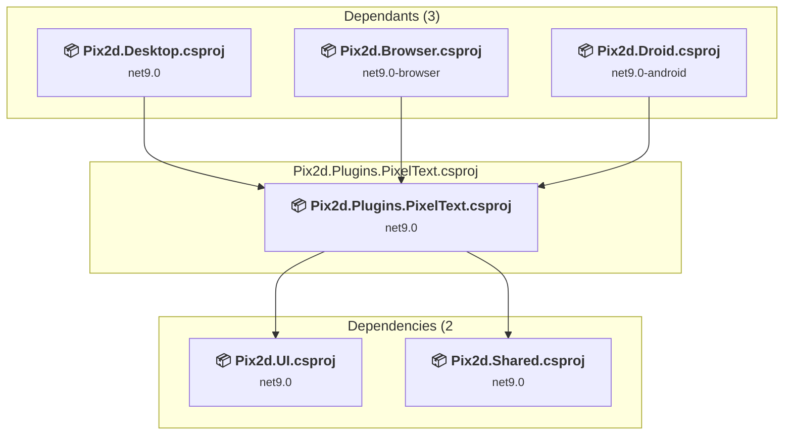

### API Compatibility

| Category | Count | Impact |
| :--- | :---: | :--- |
| 🔴 Binary Incompatible | 0 | High - Require code changes |
| 🟡 Source Incompatible | 0 | Medium - Needs re-compilation and potential conflicting API error fixing |
| 🔵 Behavioral change | 0 | Low - Behavioral changes that may require testing at runtime |
| ✅ Compatible | 794 |  |
| ***Total APIs Analyzed*** | ***794*** |  |

### Plugins\Pix2d.Plugins.PngCompress\Pix2d.Plugins.PngCompress.csproj

#### Project Info

- **Current Target Framework:** net9.0
- **Proposed Target Framework:** net10.0
- **SDK-style**: True
- **Project Kind:** ClassLibrary
- **Dependencies**: 2
- **Dependants**: 2
- **Number of Files**: 3
- **Number of Files with Incidents**: 3
- **Lines of Code**: 268
- **Estimated LOC to modify**: 2+ (at least 0.7% of the project)

#### Dependency Graph

Legend:
📦 SDK-style project
⚙️ Classic project

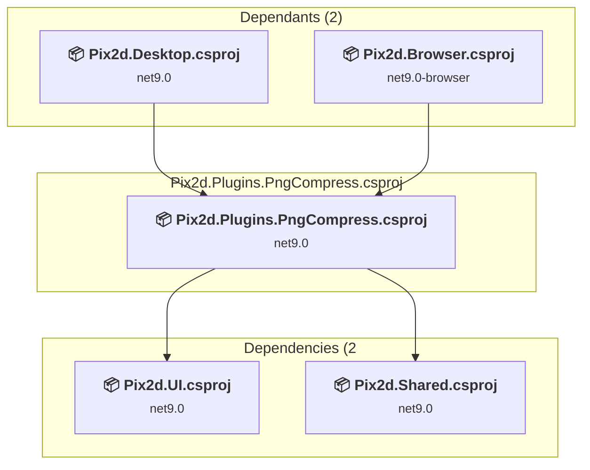

### API Compatibility

| Category | Count | Impact |
| :--- | :---: | :--- |
| 🔴 Binary Incompatible | 0 | High - Require code changes |
| 🟡 Source Incompatible | 0 | Medium - Needs re-compilation and potential conflicting API error fixing |
| 🔵 Behavioral change | 2 | Low - Behavioral changes that may require testing at runtime |
| ✅ Compatible | 329 |  |
| ***Total APIs Analyzed*** | ***331*** |  |

### Plugins\Pix2d.Plugins.SimplePlugin\Pix2d.Plugins.Simple.csproj

#### Project Info

- **Current Target Framework:** net9.0
- **Proposed Target Framework:** net10.0
- **SDK-style**: True
- **Project Kind:** ClassLibrary
- **Dependencies**: 1
- **Dependants**: 0
- **Number of Files**: 2
- **Number of Files with Incidents**: 2
- **Lines of Code**: 32
- **Estimated LOC to modify**: 0+ (at least 0.0% of the project)

#### Dependency Graph

Legend:
📦 SDK-style project
⚙️ Classic project

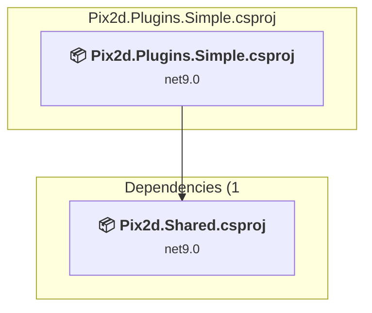

### API Compatibility

| Category | Count | Impact |
| :--- | :---: | :--- |
| 🔴 Binary Incompatible | 0 | High - Require code changes |
| 🟡 Source Incompatible | 0 | Medium - Needs re-compilation and potential conflicting API error fixing |
| 🔵 Behavioral change | 0 | Low - Behavioral changes that may require testing at runtime |
| ✅ Compatible | 10 |  |
| ***Total APIs Analyzed*** | ***10*** |  |

### Tests\Pix2d.Core.Tests\Pix2d.Core.Tests.csproj

#### Project Info

- **Current Target Framework:** net9.0
- **Proposed Target Framework:** net10.0
- **SDK-style**: True
- **Project Kind:** DotNetCoreApp
- **Dependencies**: 1
- **Dependants**: 0
- **Number of Files**: 7
- **Number of Files with Incidents**: 2
- **Lines of Code**: 203
- **Estimated LOC to modify**: 0+ (at least 0.0% of the project)

#### Dependency Graph

Legend:
📦 SDK-style project
⚙️ Classic project

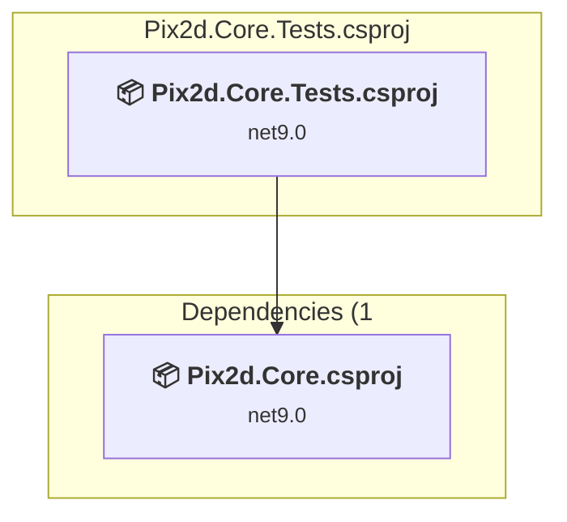

### API Compatibility

| Category | Count | Impact |
| :--- | :---: | :--- |
| 🔴 Binary Incompatible | 0 | High - Require code changes |
| 🟡 Source Incompatible | 0 | Medium - Needs re-compilation and potential conflicting API error fixing |
| 🔵 Behavioral change | 0 | Low - Behavioral changes that may require testing at runtime |
| ✅ Compatible | 158 |  |
| ***Total APIs Analyzed*** | ***158*** |  |

