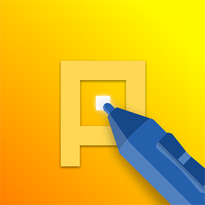

# Pix2D

<!-- TODO: Add build status, version, and other relevant badges -->

A powerful animated sprite, game art, and pixel art editor with modern UI, optimized for desktop, tablet, and smartphone use.

**Art made by [Alena Shcherbacheva](https://www.artstation.com/alys_h)**

## Description

Pix2D is a versatile graphics editor designed specifically for game developers and digital artists. It provides a comprehensive set of tools for creating and editing sprites, pixel art, and animations with a focus on modern user experience across multiple platforms.

## Key Features

- **Modern UI** optimized for desktop, tablet, and smartphone use
- **Sprite Creation & Editing** with advanced tools
- **Pixel Art Toolset** with pixel-perfect precision
- **Animation Support** with onion skinning
- **Layer System** with blend modes and effects
- **Cross-Platform** support (Windows, Linux, Android, Web)
- **Plugin Architecture** for extensibility
- **Custom File Format** (.pix2d) for project management
- **Multiple Export Formats** support
- **Professional Tools:**
  - Palette control
  - Brush settings
  - Layer effects
  - Custom grids
  - Text tools
  - Pixel-perfect shapes

## Status

This repository contains the official documentation and projects for Pix2D. The public APIs and plugin system are under development and will be available soon.

## Installation

### Windows
- Download from [Windows Store](https://pix2d.com)
- Or download the Windows Installer from our [official website](https://pix2d.com)

### Linux
- Linux version available at [pix2d.com](https://pix2d.com)

### Android
- Get it on [Google Play](https://pix2d.com)

### Web Version
- Access online at [pix2d.com](https://pix2d.com)

## Usage

For detailed usage instructions and tutorials, please visit our [documentation](./docs/).

## Contributing

We welcome contributions! Please see our [Contributing Guidelines](./CONTRIBUTING.md) for details on how to:
- Report bugs
- Suggest new features
- Submit code changes
- Improve documentation

## Support

<!-- TODO: Add support channels -->
- Official Website: [pix2d.com](https://pix2d.com)
- Telegram channel: [https://t.me/pix2dApp](https://t.me/pix2dApp)
- Bug Reports: GitHub Issues

## License

This project is licensed under the MIT License - see the [LICENSE](./LICENSE) file for details.

### Modules and dependencies used in this project

| Module/Dependency      | License/Source       | Notes                                        |
| :--------------------- | :------------------- | :------------------------------------------- |
| [Spine Runtimes](http://esotericsoftware.com/spine-runtimes) | Spine Editor License | Used in Spine plugin, license headers present |
| [Newtonsoft.Json](https://www.newtonsoft.com/json) | MIT                  | JSON serialization                           |
| [Avalonia](https://avaloniaui.net/) | MIT                  | UI framework                                 |
| [Avalonia.Markup.Declarative](https://github.com/AvaloniaUI/Avalonia.Markup.Declarative) | MIT                  | Declarative UI framework for defining views with C# code instead of XAML, including .NET 6.0+ Hot Reload support |
| [SixLabors.ImageSharp](https://github.com/SixLabors/ImageSharp) | Apache 2.0 (details in [Six Labors Split License](https://github.com/SixLabors/ImageSharp?tab=License-1-ov-file#readme)) | The Best image processing library for .net |
| [CommonServiceLocator](https://github.com/unitycontainer/commonservicelocator) | MIT                  | Service locator pattern                      |
| [Mvvm.Messaging](https://github.com/mvvmcross/MvvmCross) | MIT                  | MVVM messaging                               |
| [xUnit](https://xunit.net/) | Apache 2.0           | Unit testing                                 |

## Acknowledgements

<!-- TODO: Add acknowledgements -->
- Thanks to all contributors
- Special thanks to our community

---
Made with ❤️ by the Pix2D Team
