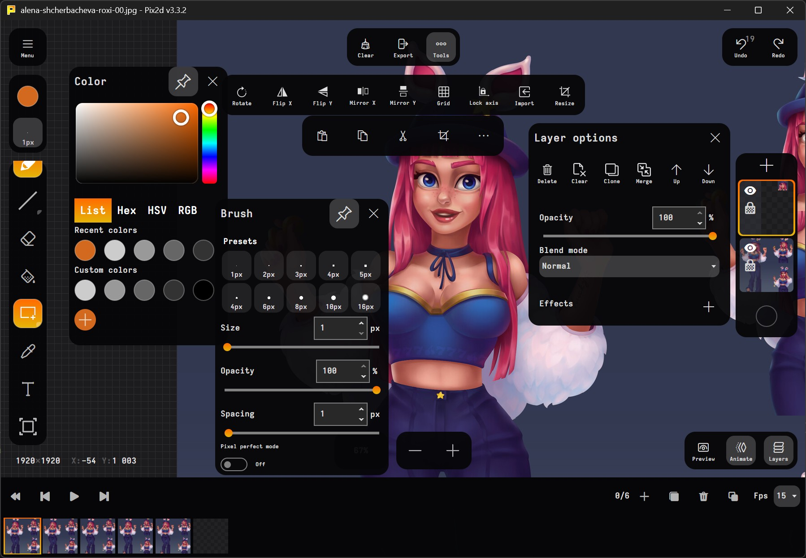

#  Open source Game Art Editor

Welcome to the Pix2D documentation!

Pix2D is a modern, cross-platform editor for animated sprites, game art, and pixel art. Designed for desktops, tablets, and smartphones, Pix2D offers a rich set of features for artists and game developers.

## Core Features

- **Modern UI**: Clean, intuitive interface optimized for productivity on all devices.
- **Sprite & Animation Support**: Create and edit animated sprites with onion skinning and timeline tools.
- **Pixel Art Tools**: Dedicated tools for pixel-perfect drawing, including custom grids and pixel-perfect shapes.
- **Layer System**: Full support for multiple layers, blend modes, and layer effects.
- **Palette Control**: Advanced palette management for precise color work.
- **Brush Settings**: Customizable brushes for unique styles and workflows.
- **Original Preview**: Real-time preview of your artwork at original and scaled sizes.
- **Extra Tools**: Selection, fill, transform, and more for efficient editing.
- **Text Tool**: Add and edit text directly on your canvas.
- **Format Support**: Import and export a wide range of image and animation formats.
- **Mobile App**: Take your art on the go with the Android version.

## Upcoming Features
- **Layout Mode**: Arrange and manage multiple assets in a single workspace.
- **Scripting & Plugins**: Extend Pix2D with custom scripts and plugins.

## Get Started
- [User Guide](user_guide.md)
- [Developer Guide](developer_guide.md)
- [API Reference](api_reference.md)

For more information, visit the [official website](https://pix2d.com) or check out the [community](https://boosty.to/pix2d).
